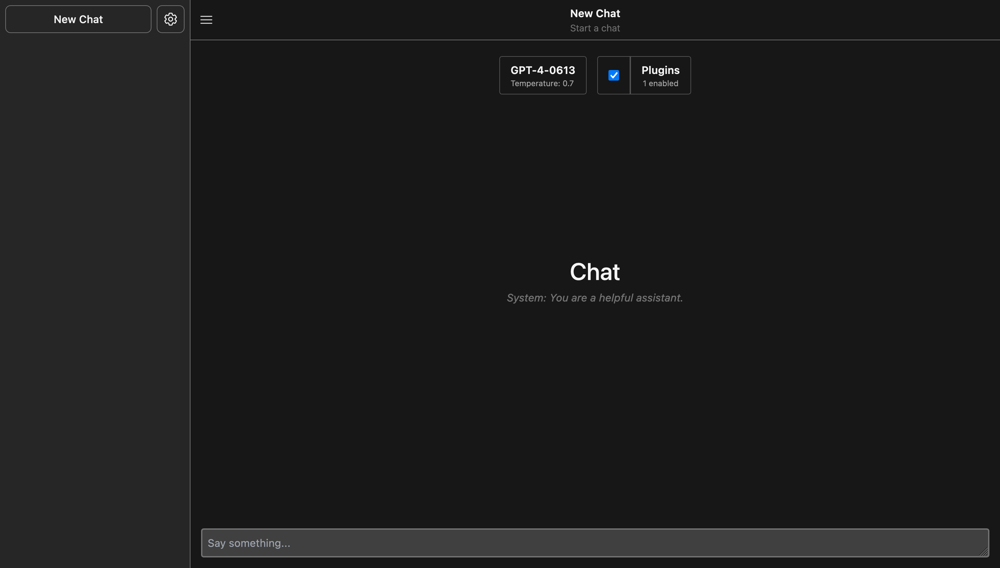
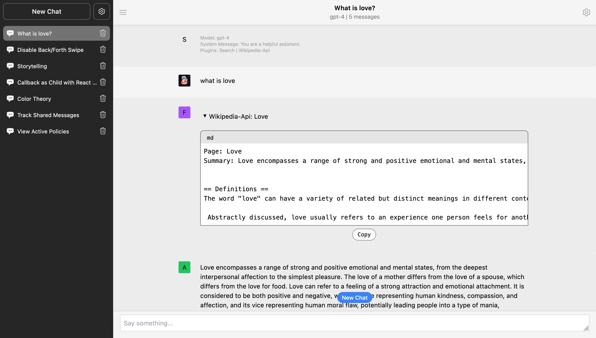

# Chat: Conversational AI Application

## Description

Chat is a versatile AI chat application, leveraging OpenAI's ChatGPT to offer a dynamic chat experience. It serves as a platform where users can interact with an AI, customize its personality, and engage in meaningful conversation. Ideal for those seeking a virtual assistant, language practice, or simply an engaging conversation.

## Key Features

Chat comes with a range of features designed to enhance user experience:

-   **Chat Personalization**: Customize the AI's personality with a leading system message.
-   **Interactivity**: The AI can hold a conversation and use functions to perform tasks.
-   **Fast Streaming**: Leverages Edge Functions for quick and seamless exchanges.
-   **Share Chat**: Share your conversations with a generated link.
-   **Data Storage**: Securely stores data in Supabase database.
-   **OAuth Access**: Provides GitHub OAuth access via Clerk.com.
-   **Responsive Design**: Offers a responsive design with dark mode and PWA.

## Installation

To install and run the application locally, follow these steps:

1. Clone the repository to your local machine.
2. Navigate to the project directory.
3. Run `pnpm i` to install the necessary packages.
4. Use the `example.env` file to create a `.env.local` file.
5. Run `npm run dev` to start the application.

## Roadmap

We're constantly working on improving Chat with new features:

-   **Character Presets**: Users can select from a range of preset characters.
-   **User Info**: Users can store information about themselves for use in all chats.
-   **Import/Export Chat**: Easily import or export chat data.

## Technologies Used

-   Next.js 13
-   Edge Functions
-   TypeScript
-   Tailwind CSS
-   OpenAI API
-   Clerk.com (OAuth)
-   Supabase (PostgreSQL)

## Contribution

We welcome contributions to the development of Chat. Feel free to fork the repository and submit a pull request.

## License

This project is licensed under the MIT License. For more details, please see the [LICENSE.md](LICENSE.md) file.

Chat is a blend of technology and creativity, aiming to redefine the way we interact with AI. Join us on this journey today!
